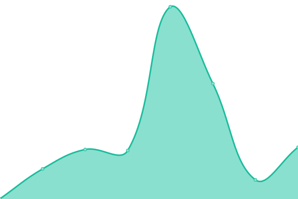

# [📈 Live Status](https://【你的 GitHub username】『star1437』.github.io/【你的 repo name】『upptime』): <!--live status--> **🟧 部分停机**

This repository contains the open-source uptime monitor and status page for [【你的 GitHub username】『star1437』](https://【你的 GitHub username】『star1437』.github.io/【你的 repo name】『upptime』), powered by [Upptime](https://github.com/upptime/upptime).

With [Upptime](https://upptime.js.org), you can get your own unlimited and free uptime monitor and status page, powered entirely by a GitHub repository. We use [Issues](https://github.com/【你的 GitHub username】『star1437』/【你的 repo name】『upptime』/issues) as incident reports, [Actions](https://github.com/【你的 GitHub username】『star1437』/【你的 repo name】『upptime』/actions) as uptime monitors, and [Pages](https://【你的 GitHub username】『star1437』.github.io/【你的 repo name】『upptime』) for the status page.

<!--start: status pages-->
<!-- This summary is generated by Upptime (https://github.com/upptime/upptime) -->
<!-- Do not edit this manually, your changes will be overwritten -->
<!-- prettier-ignore -->
| 链接 | 状态 | 历史 | 响应时间 | 正常运行时间 |
| --- | ------ | ------- | ------------- | ------ |
|  [Google](https://www.google.com) | 🟩 正常运行 | [google.yml](https://github.com/star1437/upptime/commits/HEAD/history/google.yml) | 

 153毫秒
     
 | 

<a href="https://demo.upptime.js.org/history/google">100.00%</a>
    

|  [Wikipedia](https://en.wikipedia.org) | 🟩 正常运行 | [wikipedia.yml](https://github.com/star1437/upptime/commits/HEAD/history/wikipedia.yml) | 

 180毫秒
     
 | 

<a href="https://demo.upptime.js.org/history/wikipedia">100.00%</a>
    

|  [Hacker News](https://news.ycombinator.com) | 🟩 正常运行 | [hacker-news.yml](https://github.com/star1437/upptime/commits/HEAD/history/hacker-news.yml) | 

 393毫秒
     
 | 

<a href="https://demo.upptime.js.org/history/hacker-news">100.00%</a>
    

|  [Test Broken Site](https://thissitedoesnotexist.koj.co) | 🟥 停机 | [test-broken-site.yml](https://github.com/star1437/upptime/commits/HEAD/history/test-broken-site.yml) | 

 0毫秒
     
 | 

<a href="https://demo.upptime.js.org/history/test-broken-site">0.00%</a>
    

<!--end: status pages-->

[**Visit our status website →**](https://【你的 GitHub username】『star1437』.github.io/【你的 repo name】『upptime』)

## 📄 License

- Powered by: [Upptime](https://github.com/upptime/upptime)
- Code: [MIT](./LICENSE) © [【你的 GitHub username】『star1437』](https://【你的 GitHub username】『star1437』.github.io/【你的 repo name】『upptime』)
- Data in the `./history` directory: [Open Database License](https://opendatacommons.org/licenses/odbl/1-0/)
